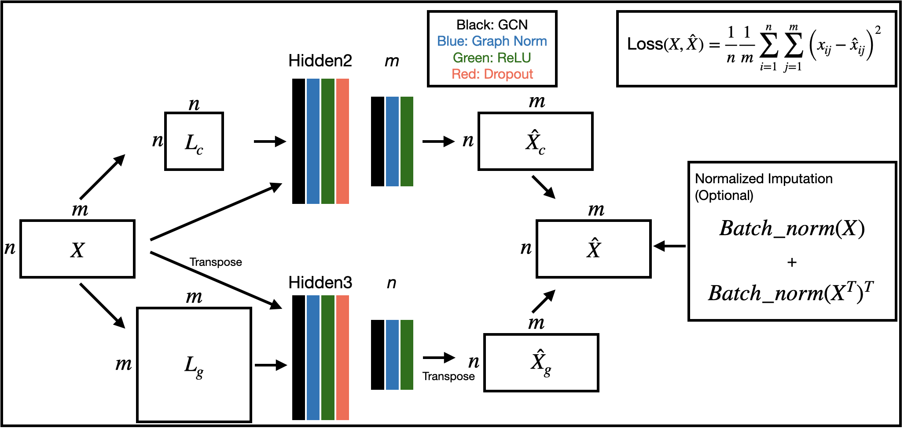

# BiGCN: Leveraging Cell and Gene Similarities for Single-cell Transcriptome Imputation with Bi-Graph Convolutional Networks



This is an official implementation of the paper, "BiGCN: Leveraging Cell and Gene Similarities for Single-cell Transcriptome Imputation with Bi-Graph Convolutional Networks"

scBiGCN is a method that utilizes two GCNs to reconstruct gene expression matrices based on the similarity matrices of cells and genes. Using each similarity enables the recovery of information lost through Dropout.

scBiGCN has been implemented in Python.

To get started immediately, check out our tutorials:
- [Tutorial](https://github.com/inoue0426/scBiGCN/blob/main/sample%20notebook.ipynb)

## Requirement

```
numpy==1.23.5
pandas==2.0.3
scikit-learn==1.3.0
torch==1.13.1+cu116
torch-geometric==2.3.1
torch-sparse==0.6.17+pt113cu116
tqdm==4.65.0
```

** Note: To utilize GPU acceleration, it is necessary to configure your own CUDA environment for PyTorch and PyTorch-Sparse.

## Environment

Our experiment was conducted on Ubuntu with an RTX 2080 and Nvidia A100. To use this model, please adjust the requirements to suit your environment, paying special attention to the PyTorch-related libraries. 

## Installation from GitHub
To clone the repository and install manually, run the following from a terminal:
```
git clone git@github.com:inoue0426/scBiGCN.git
cd scBiGCN
conda create --name scBiGCN python=3.10 -y
conda activate scBiGCN
pip install -r  requirement.txt
# Please make sure to change the version to match the version of your GPU/CPU machine exactly.
pip install --no-cache-dir  torch==1.13.1+cu116 --extra-index-url https://download.pytorch.org/whl/cu116
pip install --no-cache-dir torch_geometric
pip install --no-cache-dir pyg_lib torch_scatter torch_sparse torch_cluster torch_spline_conv -f https://data.pyg.org/whl/torch-1.13.1%2Bcu116.html
```

## Usage

### Quick Start

The following code runs scBiGCN on test data located in the scBiGCN repository.

```python
import pandas as pd
import bigcn

df = pd.read_csv('sample_data/sample_data.csv.gz', index_col=0)
bigcn.run_model(df, verbose=True)
```

## Help
If you have any questions or require assistance using MAGIC, please feel free to make an issue on https://github.com/inoue0426/scBiGCN/
